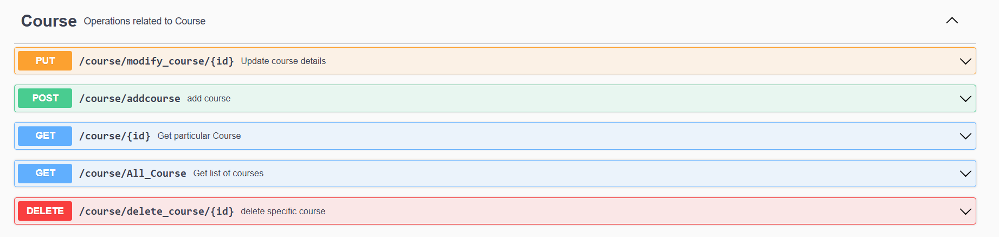
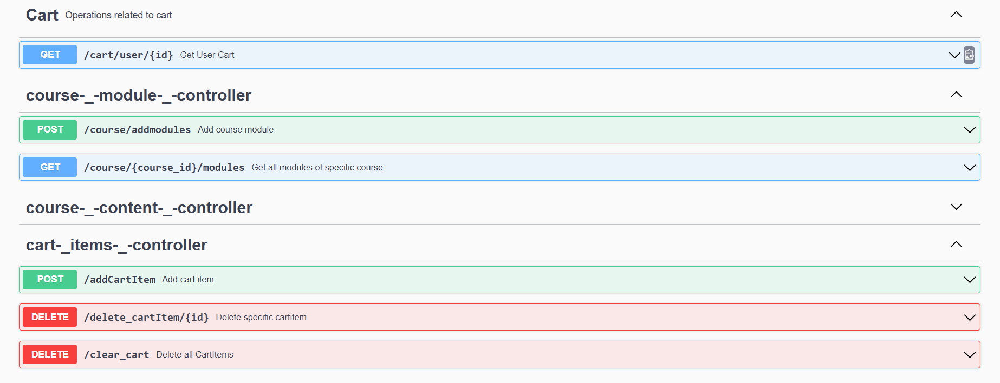

# 🎓 Online Course Management System (Backend API)

A backend system for managing online courses, similar to **Udemy** or **Coursera**, built with **Spring Boot** and **MySQL**.  
It includes functionality for users, courses, modules, content, cart, and course purchases, with **Swagger API documentation**.

> ⚠️ Note: This project is not deployed, but you can run it locally.

---

## 🛠️ Tech Stack

| Component         | Technology            |
| ----------------- | ------------------- |
| Backend           | Spring Boot         |
| Language          | Java                |
| Database          | MySQL               |
| ORM               | Hibernate / JPA     |
| API Documentation | Swagger (OpenAPI 3) |
| Build Tool        | Maven               |

---

## 🚀 Features

- **User Management**: Add, update, delete users; update password; admin view all users.  
- **Course Management**: Create, update, delete courses; fetch courses with pagination.  
- **Course Modules & Content**: Add modules and content, fetch content by module.  
- **User Course Purchases**: Buy courses, view purchased courses.  
- **Cart System**: Add items, view cart, delete items, clear cart.

---

## ⚙️ How to Run Locally

### 1️⃣ Clone Repository
```bash
https://github.com/MdAqueeb/Online_Course_Management.git
cd online-course-management
```
---

### 2️⃣ Swagger API Documentation

After starting the application, you can view all API endpoints here:

[Swagger UI](http://localhost:8080/swagger-ui/index.html)

## 🖼️ Screenshots

### Swagger UI


### Users API
 

### Courses API


### Cart API


--- 
## 📝 Future Enhancements

- JWT Authentication
- Instructor/Admin role
- Course ratings & reviews
- Certificate generation
- Video hosting & streaming
- Payment gateway integration (Razorpay / Stripe)

